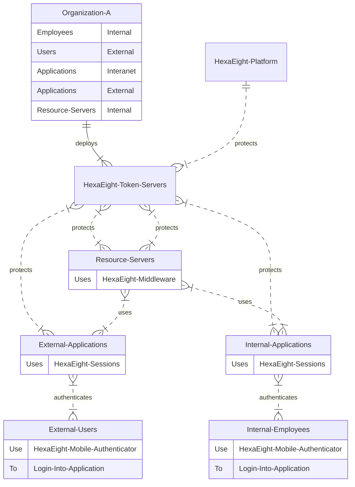
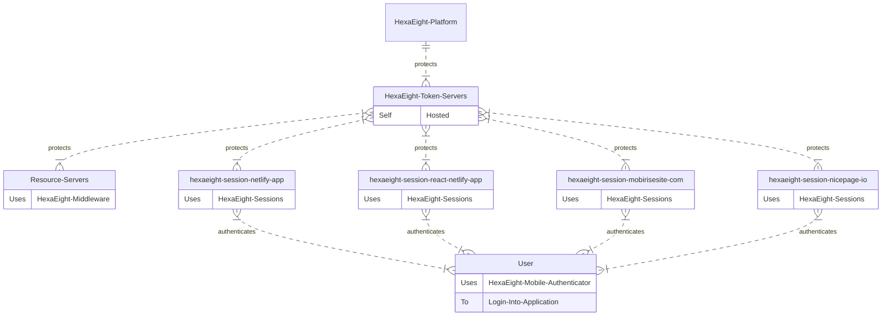

# HexaEight Session For Front-End Application

## Integrate Hexaight Session In Progressive/Single Page Apps, Static Websites using JavaScript


## How To Integrate HexaEight Sessions

1. Build your Front-End App using your favorite Static Site Generator or Site Builders
2. Implement HexaEight Authentication in Javascript by adding the below script tags to the HEAD section

```
	<script src="https://cdn.jsdelivr.net/gh/hexaeightteam/session-js-spa-https/hexaeightsession.js"></script>
	<script src="https://cdn.jsdelivr.net/npm/axios@1.1.2/dist/axios.min.js"></script>
	<script src="https://cdn.jsdelivr.net/gh/hexaeightteam/session-js-spa-https/hexaeightaxios.js"></script>
```

3. Generate your Application Client ID using HexaEight Token Server and use the below code to activate HexaEight Sessions using JQuery.

```
<script src="https://cdnjs.cloudflare.com/ajax/libs/jquery/3.6.4/jquery.min.js"></script>

<script>
  // Script your Call back function to initialize Application post authetication. 
  // HexaEight Session will automatically call your function post user authentication
  function callback() {
  }
  const session = new HexaEight();
  $(document).ready(async function() {
	const clientid  = "87ADEE......";
	const tokenserverurl =  "https://mytokenserver:5000";
	const state = await session.init(clientid,tokenserverurl,callback);
  }); 
</script>
```

4. Generate your [Client Application SHA512 Hash)(https://passwordsgenerator.net/sha512-hash-generator/) and enable access for your application in HexaEight Token Server. So if your hosting your client application in dashboard.mydomain.com, then your client hash will be SHA512 of dashboard.mydomain.com which is 85EB85A9484217374C95A62B1B5F8E3FC6FB691584B442F6B82D6CAFE3D1C818C716BDAEA0E5E6D07D647AFD51546B268080D19CA2C13F8095DF6BC9C27EB985 (all upper case).

5. Launch your front end application and you should see a login page to authennticate users.

Client ID can be obtained from [Token server](https://github.com/HexaEightTeam/HexaEight-Token-Server).  

### Demos / Integrations


| Serial        | Demo Application Link   | Site Link  | Source Code Link |
| ------------- |:-----------------------:| ----------:|---------------------:
| 1. | [VueJS](https://hexaeight-session.netlify.app) | www.vuejs.org | [Source](https://github.com/HexaEightTeam/vuejs-authentication-using-hexaeight-sessions)|
| 2. | [REACT](https://hexaeight-session-react.netlify.app/) | www.react.dev | [Source](https://github.com/HexaEightTeam/react-authentication-using-hexaeight-session)|
| 3. | [MOBIRISE](https://hexaeight-session.mobirisesite.com) | www.mobirise.com ||
| 4. | [NICEPAGE](https://hexaeight-session.nicepage.io)| www.nicepage.io ||

### HexaEight Authentication Overview

HexaEight provides authentication for your javascript application.  A single self hosted token server can protect single or multiple applications hosted on a single site or on multiple sites.  



---


---

### HexaEight Session provides the following features post user authentication

1. Application Layer Encryption / Decryption to any destination (Can be another user/resource)
2. Data Protection to store user data in browser storage.
3. An Axios Instance to establish authenticated communiation with Resource servers running HexaEight Sessions Middleware

---
### Quick FAQ 

**Q. Can HexaEight Sesssion authenticate any Email Address?**

A. Yes, Any Email address, social, personal or work email address except temporary email addresses

**Q. Is it possble to deploy HexaEight Session on Sites like Wix, HubSpot, Bubble, Medium, GitHub Pages ... ??**

A. HexaEight Session can be deployed anywhere by incorporating the above Javascript code. As long as the external site does not interfere with Vanilla Javascript, it would gel well with HexaEight Authentication, for example Wix uses Velo and does not allow direct access to DOM, so HexaEight Authentication may not work as expected. So you can try implementing HexaEight Session on any external site and if you run into problems, shout out to us and we will bee happy to help.

**Q. What prevents someone from cloning my static site and hosting it elsewhere. ??**

A. HexaEight Token Server will only authorize HexaEight Sessions based on Client Hashes to protect your static site from cloning and hosting it in a different domain. So when the user tries to authenticate on a cloned site, they will see the Unauthorized Client message because HexaEight Token server will automatically detect that the request is originating from a different site and block the request.

**Q. HexaEight session does not prompt for password during authentication, so how does the authentication work?**

A. Correct, HexaEight Session displays a QR Code after entering your email address. Upon displaying the first QR Code, you need to scan it using a Resource token which is available in Official HexaEight Mobile App. In order to use this Resource Identity token, you will need to type your hexaeight vault password associated with your email address. Once you see the message in the HexaEight Mobile App, stating the Client was authorized successfully you can move to the next step by clicking the PROCEED button. The second QR Code is a two-factor encrypted QR Code which needs to be scanned using Email Identity Token. This will reveal a 5 letter Code which can be typed into the Captcha box to complete the authentication. So to summarize, you will need to remember only one password that is tied to your email address inside Official Mobile App provided by HexaEight at any given time to login to any application in any domain  that implements HexaEight Session.

**Q. Can I deploy HexaEight Session on Mobile Apps and How can users login since they are displayed a QRCode instead of prompting for a password.**

A. Yes its possible to integrate HexaEight Sessions in Mobile Apps using our .NET Library inside a Xamarin App, however if you want to integrate the above Javascript code, we would recommend a PWA since it would integrate nicely with the Vanilla Javascript. We are in the process of preparing the demos for using HexaEight Sessions in Mobile Apps and we will be dedicating a different page to show cases the demo for mobile apps when ready. Regarding authentication, users are providd with a link below the QRCode which they can tap and be redircted to the Official HexaEight Mobile Application which will complete the authentication process.

---

**Limitations : This authentication works only for Single Page Applications.**  

**HexaEight Session implements application layer enncryption using authenticated encryption and hence does NOT depend on HTTPS for functionality**


