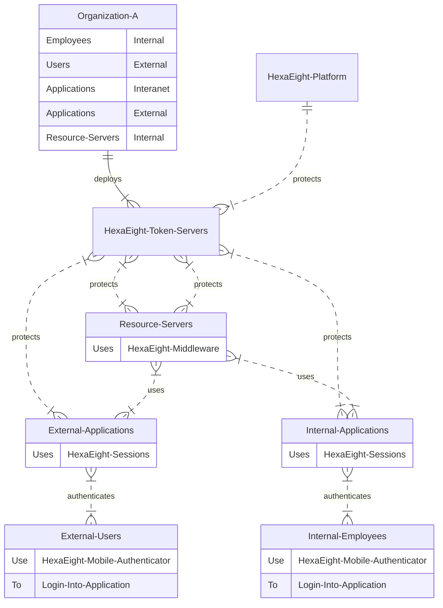

# Hexaight Session For Single Page Apps and Websites using JavaScript

## Implement HexaEight Authentication in Javascript using the following steps

1. Add the below script tag to the HEAD section

```
	<script src="https://cdn.jsdelivr.net/gh/hexaeightteam/session-js-spa-https/hexaeightsession.js"></script>
	<script src="https://cdn.jsdelivr.net/npm/axios@1.1.2/dist/axios.min.js"></script>
	<script src="https://cdn.jsdelivr.net/gh/hexaeightteam/session-js-spa-https/hexaeightaxios.js"></script>
```
(NPM version will be released soon...)

2. Add JQuery in case you wish to use $.

```
<script src="https://cdnjs.cloudflare.com/ajax/libs/jquery/3.6.4/jquery.min.js"></script>


<script>
  // Script your Call back function to initialize Application post authetication. 
  // HexaEight Session will automatically call your function post user authentication
  function callback() {
  }
  const session = new HexaEight();
  $(document).ready(async function() {
	const clientid  = "87ADEE......";
	const tokenserverurl =  "https://mytokenserver:5000";
	const state = await session.init(clientid,tokenserverurl,callback);
  }); 
</script>
```

Client ID can be obtained from [Token server](https://github.com/HexaEightTeam/HexaEight-Token-Server).  

### Overview

# Architecture

Below is the pictorial representation of the architecture and the relationship with the various components of HexaEight Authentication platform.

!!! HexaEight Platform (IdP)
HexaEight Platform manages identities, provides Identity Login tokens and issues Asymmetric shared Keys for specific destinations to Users and Machines.
!!!
!!! HexaEight Token Servers
HexaEight Token Server manages authorization and fetches asymmetric shared keys for users and resource Servers in Client Applications
!!!
!!! HexaEight Middleware
HexaEight Middleware is installed on Resource Servers and associated with a Client Application. HexaEight Middleware allows Resource servers to authenticate and communicate across Client Applications. Additionally, it decrypts all incoming and encrypts all outgoing requests to maintain data confidentiality as well as protecting them from potential attacks and unauthorized access
!!!
!!! HexaEight-Mobile-Authenticator
HexaEight provides a Free Mobile app available for both Android and iOS that is used by end users to authenticate across applications, systems and devices.  The mobile application is also used by Application owners and administrators to authorize Machines Identities
!!!


<style>
    .sample {
        text-align: center;
        color: #1956AF;
        border-radius: 10px;
        background-color: #E1EDFF;
        border: 1px solid #1956AF;
        padding-top: 20px;
        margin-bottom: 20px;
    }
</style>

### Applications and Resource Servers

:::sample

:::


## Sample Integrations

---

### Static Web Site Generator tool Demos:

**[Sessions Demo on mobirisesite.com](https://hexaeight-session.mobirisesite.com) - Fully functional authentication Site was built using Mobirise Free desktop tool and published to their site using the Publish feature.**

---

**[Sessions Demo on nicepage.io](https://hexaeight-session.nicepage.io/) - Site was built using NicePage Free desktop tool and published to their site.**

---

### REACT

Sample Demo is hosted [HERE](https://hexaeight-session.netlify.app/) and Source is available [HERE](https://github.com/HexaEightTeam/react-hexaeight-session-demo) 

### VUE

Coming Soon...

**Limitation : This authentication works only for Single Page Applications.**  

**HexaEight Session implements application layer enncryption using authenticated encryption and hence does NOT depend on HTTPS for functionality. In case you are interested in authentication for http sites, the library will be available shortly)**


