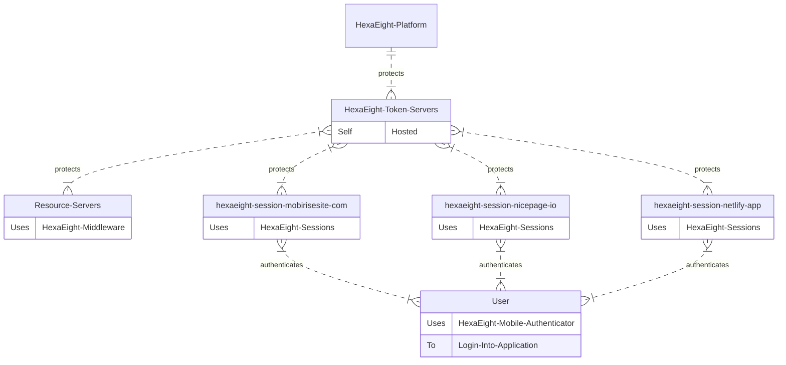

# Hexaight Session For Single Page Apps and Websites using JavaScript

## Implement HexaEight Authentication in Javascript using the following steps

1. Add the below script tag to the HEAD section

```
	<script src="https://cdn.jsdelivr.net/gh/hexaeightteam/session-js-spa-https/hexaeightsession.js"></script>
	<script src="https://cdn.jsdelivr.net/npm/axios@1.1.2/dist/axios.min.js"></script>
	<script src="https://cdn.jsdelivr.net/gh/hexaeightteam/session-js-spa-https/hexaeightaxios.js"></script>
```
(NPM version will be released soon...)

2. Add JQuery in case you wish to use $.

```
<script src="https://cdnjs.cloudflare.com/ajax/libs/jquery/3.6.4/jquery.min.js"></script>


<script>
  // Script your Call back function to initialize Application post authetication. 
  // HexaEight Session will automatically call your function post user authentication
  function callback() {
  }
  const session = new HexaEight();
  $(document).ready(async function() {
	const clientid  = "87ADEE......";
	const tokenserverurl =  "https://mytokenserver:5000";
	const state = await session.init(clientid,tokenserverurl,callback);
  }); 
</script>
```

Client ID can be obtained from [Token server](https://github.com/HexaEightTeam/HexaEight-Token-Server).  

### HexaEight Authentication Overview

HexaEight provides authentication for your javascript application.  A single self hosted token server can protect single or multiple applications hosted on a single site or on multiple sites.  


---


---


## Sample Integrations

---

### Static Web Site Generator tool Demos:

**[Sessions Demo on mobirisesite.com](https://hexaeight-session.mobirisesite.com) - Fully functional authentication Site was built using Mobirise Free desktop tool and published to their site using the Publish feature.**

---

**[Sessions Demo on nicepage.io](https://hexaeight-session.nicepage.io/) - Site was built using NicePage Free desktop tool and published to their site.**

---

### REACT

Sample Demo is hosted [HERE](https://hexaeight-session.netlify.app/) and Source is available [HERE](https://github.com/HexaEightTeam/react-hexaeight-session-demo) 

### VUE

Coming Soon...

**Limitation : This authentication works only for Single Page Applications.**  

**HexaEight Session implements application layer enncryption using authenticated encryption and hence does NOT depend on HTTPS for functionality. In case you are interested in authentication for http sites, the library will be available shortly)**


